Analysis of Phagocytosis assay 


```r
rm(list=ls())

library(ggplot2)
library(tidyverse)
```

```
## ── Attaching core tidyverse packages ──────────────────────── tidyverse 2.0.0 ──
## ✔ dplyr     1.1.2     ✔ readr     2.1.4
## ✔ forcats   1.0.0     ✔ stringr   1.5.0
## ✔ lubridate 1.9.2     ✔ tibble    3.2.1
## ✔ purrr     1.0.2     ✔ tidyr     1.3.0
## ── Conflicts ────────────────────────────────────────── tidyverse_conflicts() ──
## ✖ dplyr::filter() masks stats::filter()
## ✖ dplyr::lag()    masks stats::lag()
## ℹ Use the conflicted package (<http://conflicted.r-lib.org/>) to force all conflicts to become errors
```

```r
library(lme4)
```

```
## Loading required package: Matrix
## 
## Attaching package: 'Matrix'
## 
## The following objects are masked from 'package:tidyr':
## 
##     expand, pack, unpack
```

```r
library(effects)
```

```
## Loading required package: carData
## lattice theme set by effectsTheme()
## See ?effectsTheme for details.
```

```r
library(AICcmodavg)
```

```
## 
## Attaching package: 'AICcmodavg'
## 
## The following object is masked from 'package:lme4':
## 
##     checkConv
```

```r
library(DHARMa)
```

```
## This is DHARMa 0.4.6. For overview type '?DHARMa'. For recent changes, type news(package = 'DHARMa')
```

```r
library(emmeans)

ti <- read.csv("ti_merged_data.csv")

#select only phagocytosis assay and make new wbc total, phago total, and phago score columns
ti <- ti %>%
  filter(Well.1.WBC != "NA") %>% #select only phagocytosis assay
  mutate(wbc_total=Well.1.WBC+Well.2.WBC+Well.3.WBC+Well.4.WBC)%>% #sum of wbc quadruplicates
  mutate(phago_total=Well.1.Phago+Well.2.Phago+Well.3.Phago+Well.4.Phago) %>% #sum of phago quadruplicates
  mutate(phago_score = phago_total/(wbc_total+phago_total)) #phago score = phagocytic / total

ti <- ti%>%
  filter(dpi != 2) %>% #remove dpi 2 because only a small subset were run day 2
  drop_na(phago_score)
```

What do the data look like?

```r
g.phago <- ggplot(data=ti, aes(x=groups, y=phago_score, shape=groups))+
  geom_jitter(width = .1, size=2, stroke=1)+
  stat_summary(fun.y=mean,
               fun.min = function(y) mean(y)-sd(y),
               fun.max = function(y) mean(y)+sd(y),
               geom= "errorbar", size=0.2, width=0.1, alpha=0.75)+ #error bars
  stat_summary(aes(group=groups), fun=mean, alpha=1, size=3, shape="-")+
  labs(x="Treatment", y="Phagocytosis Score", shape="Treatment Groups")+
  scale_shape_manual(values=c(1, 2, 3, 4))
```

```
## Warning: The `fun.y` argument of `stat_summary()` is deprecated as of ggplot2 3.3.0.
## ℹ Please use the `fun` argument instead.
## This warning is displayed once every 8 hours.
## Call `lifecycle::last_lifecycle_warnings()` to see where this warning was
## generated.
```

```
## Warning: Using `size` aesthetic for lines was deprecated in ggplot2 3.4.0.
## ℹ Please use `linewidth` instead.
## This warning is displayed once every 8 hours.
## Call `lifecycle::last_lifecycle_warnings()` to see where this warning was
## generated.
```

```r
g.phago
```

```
## Warning: Removed 4 rows containing missing values (`geom_segment()`).
```

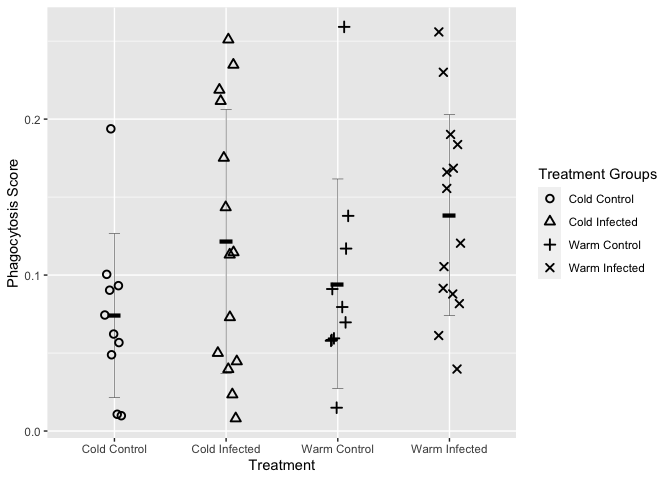<!-- -->


*Phagocytosis Model*
I use a generalized linear mixed model with a binomial distribution to test whether temperature or MG treatment affected phagocytosis activity of white blood cells.
Each cell is treated as phagocytic or not.

Infection with MG (p = 0.0296), but not temperature treatment (0.161) significantly affects phagocytic activity.

```r
glm1 <- glmer(phago_score~temp+treatment + (1|band_number), weights=wbc_total+phago_total, data=ti, family="binomial")
summary(glm1)
```

```
## Generalized linear mixed model fit by maximum likelihood (Laplace
##   Approximation) [glmerMod]
##  Family: binomial  ( logit )
## Formula: phago_score ~ temp + treatment + (1 | band_number)
##    Data: ti
## Weights: wbc_total + phago_total
## 
##      AIC      BIC   logLik deviance df.resid 
##    482.1    489.6   -237.1    474.1       44 
## 
## Scaled residuals: 
##      Min       1Q   Median       3Q      Max 
## -1.21631 -0.09325  0.02847  0.11096  0.22592 
## 
## Random effects:
##  Groups      Name        Variance Std.Dev.
##  band_number (Intercept) 0.6295   0.7934  
## Number of obs: 48, groups:  band_number, 48
## 
## Fixed effects:
##                   Estimate Std. Error z value Pr(>|z|)    
## (Intercept)        -2.7910     0.2182 -12.793   <2e-16 ***
## tempWarm            0.3294     0.2349   1.403   0.1608    
## treatmentInfected   0.5186     0.2385   2.175   0.0296 *  
## ---
## Signif. codes:  0 '***' 0.001 '**' 0.01 '*' 0.05 '.' 0.1 ' ' 1
## 
## Correlation of Fixed Effects:
##             (Intr) tmpWrm
## tempWarm    -0.545       
## trtmntInfct -0.642 -0.001
```

```r
plot(allEffects(glm1))
```

```
## Warning in eval(family$initialize): non-integer #successes in a binomial glm!

## Warning in eval(family$initialize): non-integer #successes in a binomial glm!
```

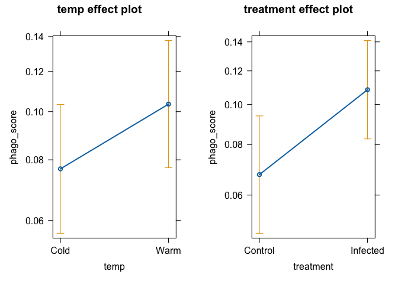<!-- -->

```r
#Model Selection
p1 <- glmer(phago_score~temp+treatment + (1|band_number), weights=wbc_total+phago_total, data=ti, family="binomial")
p2<- glmer(phago_score~temp*treatment + (1|band_number), weights=wbc_total+phago_total, data=ti, family="binomial")
p3<- glmer(phago_score~temp + (1|band_number), weights=wbc_total+phago_total, data=ti, family="binomial")
p4<- glmer(phago_score~treatment + (1|band_number), weights=wbc_total+phago_total, data=ti, family="binomial")
p5<- glmer(phago_score~1 + (1|band_number), weights=wbc_total+phago_total, data=ti, family="binomial")
p6 <- glmer(phago_score~groups + (1|band_number), weights=wbc_total+phago_total, data=ti, family="binomial")
p7 <- glmer(phago_score~temp+treatment + sex + (1|band_number), weights=wbc_total+phago_total, data=ti, family="binomial")
aictab(cand.set=list(p1, p2, p3, p4, p5, p6, p7), modnames=c("p1", "p2", "p3", "p4", "p5", "p6", "p7"))
```

```
## 
## Model selection based on AICc:
## 
##    K   AICc Delta_AICc AICcWt Cum.Wt      LL
## p4 3 482.64       0.00   0.32   0.32 -238.05
## p1 4 483.08       0.44   0.25   0.57 -237.07
## p5 2 484.72       2.08   0.11   0.68 -240.22
## p3 3 485.19       2.56   0.09   0.77 -239.32
## p7 5 485.33       2.70   0.08   0.85 -236.95
## p6 5 485.58       2.94   0.07   0.93 -237.07
## p2 5 485.58       2.94   0.07   1.00 -237.07
```

```r
#p4 best model, but use p1 to keep both temp and treatment in model
summary(p4)
```

```
## Generalized linear mixed model fit by maximum likelihood (Laplace
##   Approximation) [glmerMod]
##  Family: binomial  ( logit )
## Formula: phago_score ~ treatment + (1 | band_number)
##    Data: ti
## Weights: wbc_total + phago_total
## 
##      AIC      BIC   logLik deviance df.resid 
##    482.1    487.7   -238.0    476.1       45 
## 
## Scaled residuals: 
##      Min       1Q   Median       3Q      Max 
## -1.25236 -0.08247  0.01822  0.09078  0.23301 
## 
## Random effects:
##  Groups      Name        Variance Std.Dev.
##  band_number (Intercept) 0.6533   0.8083  
## Number of obs: 48, groups:  band_number, 48
## 
## Fixed effects:
##                   Estimate Std. Error z value Pr(>|z|)    
## (Intercept)        -2.6261     0.1862  -14.10   <2e-16 ***
## treatmentInfected   0.5194     0.2427    2.14   0.0323 *  
## ---
## Signif. codes:  0 '***' 0.001 '**' 0.01 '*' 0.05 '.' 0.1 ' ' 1
## 
## Correlation of Fixed Effects:
##             (Intr)
## trtmntInfct -0.766
```

```r
summary(p1)
```

```
## Generalized linear mixed model fit by maximum likelihood (Laplace
##   Approximation) [glmerMod]
##  Family: binomial  ( logit )
## Formula: phago_score ~ temp + treatment + (1 | band_number)
##    Data: ti
## Weights: wbc_total + phago_total
## 
##      AIC      BIC   logLik deviance df.resid 
##    482.1    489.6   -237.1    474.1       44 
## 
## Scaled residuals: 
##      Min       1Q   Median       3Q      Max 
## -1.21631 -0.09325  0.02847  0.11096  0.22592 
## 
## Random effects:
##  Groups      Name        Variance Std.Dev.
##  band_number (Intercept) 0.6295   0.7934  
## Number of obs: 48, groups:  band_number, 48
## 
## Fixed effects:
##                   Estimate Std. Error z value Pr(>|z|)    
## (Intercept)        -2.7910     0.2182 -12.793   <2e-16 ***
## tempWarm            0.3294     0.2349   1.403   0.1608    
## treatmentInfected   0.5186     0.2385   2.175   0.0296 *  
## ---
## Signif. codes:  0 '***' 0.001 '**' 0.01 '*' 0.05 '.' 0.1 ' ' 1
## 
## Correlation of Fixed Effects:
##             (Intr) tmpWrm
## tempWarm    -0.545       
## trtmntInfct -0.642 -0.001
```

```r
resid <- simulateResiduals(p1)
plot(resid)
```

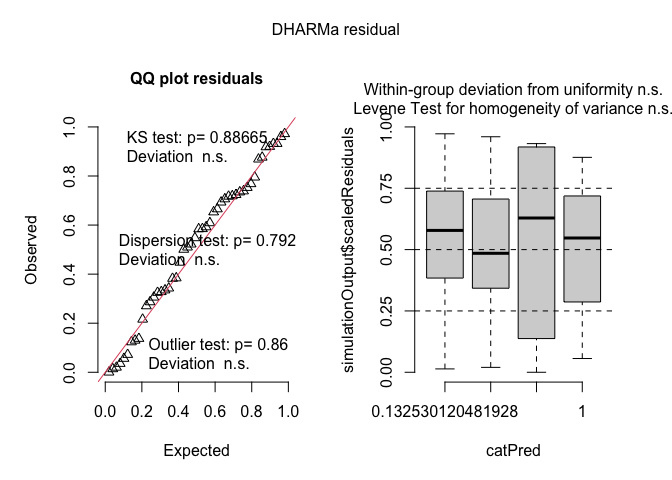<!-- -->

```r
emm_results <- emmeans(glm1, ~ temp + treatment, scale = "response")
pairs(emm_results)
```

```
##  contrast                      estimate    SE  df z.ratio p.value
##  Cold Control - Warm Control     -0.329 0.235 Inf  -1.403  0.4977
##  Cold Control - Cold Infected    -0.519 0.238 Inf  -2.175  0.1303
##  Cold Control - Warm Infected    -0.848 0.335 Inf  -2.535  0.0547
##  Warm Control - Cold Infected    -0.189 0.335 Inf  -0.565  0.9425
##  Warm Control - Warm Infected    -0.519 0.238 Inf  -2.175  0.1303
##  Cold Infected - Warm Infected   -0.329 0.235 Inf  -1.403  0.4977
## 
## Results are given on the log odds ratio (not the response) scale. 
## P value adjustment: tukey method for comparing a family of 4 estimates
```


```r
#install.packages("betareg")
library(betareg)

#beta regression
beta_mod <- betareg(phago_score ~ temp + treatment, data=ti)
summary(beta_mod)
```

```
## 
## Call:
## betareg(formula = phago_score ~ temp + treatment, data = ti)
## 
## Standardized weighted residuals 2:
##     Min      1Q  Median      3Q     Max 
## -3.1381 -0.5113  0.1671  0.6685  1.6818 
## 
## Coefficients (mean model with logit link):
##                   Estimate Std. Error z value Pr(>|z|)    
## (Intercept)        -2.4998     0.1968 -12.700   <2e-16 ***
## tempWarm            0.2992     0.1907   1.569   0.1167    
## treatmentInfected   0.4121     0.1980   2.081   0.0374 *  
## 
## Phi coefficients (precision model with identity link):
##       Estimate Std. Error z value Pr(>|z|)    
## (phi)   18.924      3.923   4.823 1.41e-06 ***
## ---
## Signif. codes:  0 '***' 0.001 '**' 0.01 '*' 0.05 '.' 0.1 ' ' 1 
## 
## Type of estimator: ML (maximum likelihood)
## Log-likelihood:  66.7 on 4 Df
## Pseudo R-squared: 0.1193
## Number of iterations: 21 (BFGS) + 3 (Fisher scoring)
```

```r
plot(allEffects(beta_mod))
```

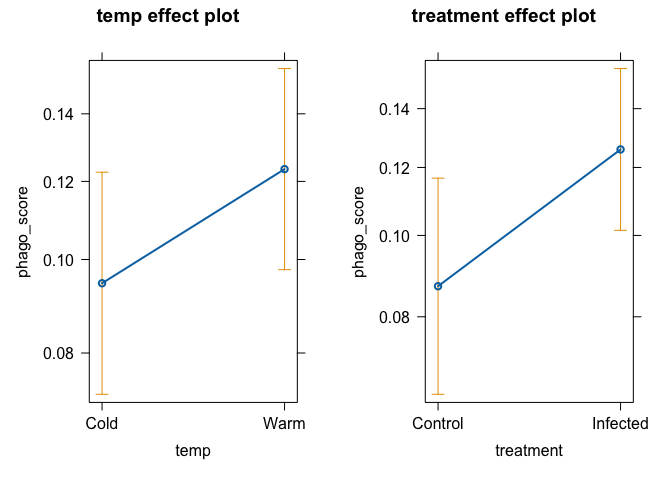<!-- -->

```r
plot(resid(beta_mod))
```

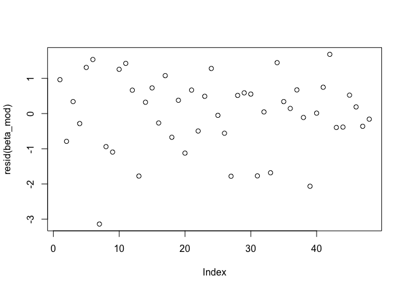<!-- -->

```r
emm_results <- emmeans(beta_mod, ~ temp + treatment, scale = "response")
pairs(emm_results)
```

```
##  contrast                      estimate     SE  df z.ratio p.value
##  Cold Control - Warm Control    -0.0238 0.0154 Inf  -1.549  0.4082
##  Cold Control - Cold Infected   -0.0344 0.0163 Inf  -2.109  0.1501
##  Cold Control - Warm Infected   -0.0674 0.0256 Inf  -2.631  0.0423
##  Warm Control - Cold Infected   -0.0106 0.0257 Inf  -0.413  0.9762
##  Warm Control - Warm Infected   -0.0436 0.0205 Inf  -2.123  0.1458
##  Cold Infected - Warm Infected  -0.0330 0.0210 Inf  -1.567  0.3977
## 
## P value adjustment: tukey method for comparing a family of 4 estimates
```


```r
#t test
treat_inf <- ti$phago_score[ti$treatment == "Infected"]
treat_cont <- ti$phago_score[ti$treatment == "Control"]
temp_warm <- ti$phago_score[ti$temp == "Warm"]
temp_cold <- ti$phago_score[ti$temp == "Cold"]
t.inf <- t.test(treat_inf, treat_cont)
t.temp <- t.test(temp_warm, temp_cold)

print(t.inf)
```

```
## 
## 	Welch Two Sample t-test
## 
## data:  treat_inf and treat_cont
## t = 2.3596, df = 45.31, p-value = 0.02266
## alternative hypothesis: true difference in means is not equal to 0
## 95 percent confidence interval:
##  0.006697652 0.084688917
## sample estimates:
##  mean of x  mean of y 
## 0.12995881 0.08426552
```

```r
print(t.temp)
```

```
## 
## 	Welch Two Sample t-test
## 
## data:  temp_warm and temp_cold
## t = 0.88743, df = 45.475, p-value = 0.3795
## alternative hypothesis: true difference in means is not equal to 0
## 95 percent confidence interval:
##  -0.02333328  0.06010952
## sample estimates:
## mean of x mean of y 
## 0.1201140 0.1017259
```

**I can't seem to get the confidence intervals for my model predictions using the predict() function**

```r
#Model Predictions
dat.new=expand.grid(temp=unique(ti$temp),
                   treatment=unique(ti$treatment))#new grid to put predictions into
dat.new$yhat = predict(beta_mod, type="response", newdata=dat.new, re.form=NA) #predicted values based off beta_mod
dat.new$inf_temp <-  paste(dat.new$treatment, dat.new$temp, sep = "_")
head(dat.new)
```

```
##   temp treatment       yhat      inf_temp
## 1 Cold  Infected 0.11029331 Infected_Cold
## 2 Warm  Infected 0.14324726 Infected_Warm
## 3 Cold   Control 0.07586954  Control_Cold
## 4 Warm   Control 0.09969065  Control_Warm
```

```r
#plot predicted values over raw data
phago.pred <- ggplot(data=ti, aes(x=treatment, y=phago_score, shape=temp))+
  geom_jitter(size=2, width=0.1)+
  geom_line(data=dat.new, aes(x=treatment, y=yhat, linetype=temp, group=temp), size=1)+ #model predictions
  stat_summary(aes(group=treatment), fun=mean, alpha=1, size=3, shape="-")+
  stat_summary(data=ti, aes(group=treatment), fun.y=mean,
               fun.min = function(y) mean(y)-sd(y),
               fun.max = function(y) mean(y)+sd(y),
               geom= "errorbar", size=0.5, width=0.1, alpha=0.75)+ #error bars
  labs(x="Infection Treatment", y="Phagocytosis Score", linetype="Temperature", shape="Temperature")+
  scale_shape_manual(values=c(0, 15),  labels= c("Cold", "Warm"))+
  scale_linetype_manual(values = c("dotted", "solid"), labels= c("Cold", "Warm"))

phago.pred
```

```
## Warning: Removed 2 rows containing missing values (`geom_segment()`).
```

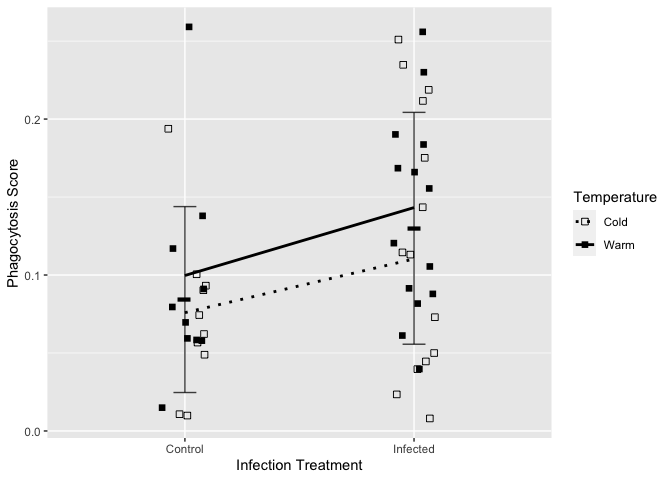<!-- -->

####Heterogeneity
Subset the phagocytois assay by groups and look at their variance

```r
glm.phago2 <- glmer(phago_score~1 + (1|band_number), weights=wbc_total+phago_total, data=ti, family="binomial")
glm.phago2a <- glmer(phago_score~1 + (1|band_number), weights=wbc_total+phago_total, data=subset(ti, inf_temp=="MG_ST"), family="binomial")
glm.phago2b <- glmer(phago_score~1 + (1|band_number), weights=wbc_total+phago_total, data=subset(ti, inf_temp=="Sham_ST"), family="binomial")
glm.phago2c <- glmer(phago_score~1 + (1|band_number), weights=wbc_total+phago_total, data=subset(ti, inf_temp=="MG_TN"), family="binomial")
glm.phago2d <- glmer(phago_score~1 + (1|band_number), weights=wbc_total+phago_total, data=subset(ti, inf_temp=="Sham_TN"), family="binomial")

summary(glm.phago2a); summary(glm.phago2b); summary(glm.phago2c); summary(glm.phago2d)
```

```
## Generalized linear mixed model fit by maximum likelihood (Laplace
##   Approximation) [glmerMod]
##  Family: binomial  ( logit )
## Formula: phago_score ~ 1 + (1 | band_number)
##    Data: subset(ti, inf_temp == "MG_ST")
## Weights: wbc_total + phago_total
## 
##      AIC      BIC   logLik deviance df.resid 
##    147.9    149.2    -72.0    143.9       12 
## 
## Scaled residuals: 
##      Min       1Q   Median       3Q      Max 
## -0.90761 -0.16566  0.03426  0.08651  0.12577 
## 
## Random effects:
##  Groups      Name        Variance Std.Dev.
##  band_number (Intercept) 0.9908   0.9954  
## Number of obs: 14, groups:  band_number, 14
## 
## Fixed effects:
##             Estimate Std. Error z value Pr(>|z|)    
## (Intercept)  -2.2935     0.2715  -8.447   <2e-16 ***
## ---
## Signif. codes:  0 '***' 0.001 '**' 0.01 '*' 0.05 '.' 0.1 ' ' 1
```

```
## Generalized linear mixed model fit by maximum likelihood (Laplace
##   Approximation) [glmerMod]
##  Family: binomial  ( logit )
## Formula: phago_score ~ 1 + (1 | band_number)
##    Data: subset(ti, inf_temp == "Sham_ST")
## Weights: wbc_total + phago_total
## 
##      AIC      BIC   logLik deviance df.resid 
##     97.3     97.9    -46.7     93.3        8 
## 
## Scaled residuals: 
##      Min       1Q   Median       3Q      Max 
## -0.73160 -0.03175  0.03547  0.09942  0.18460 
## 
## Random effects:
##  Groups      Name        Variance Std.Dev.
##  band_number (Intercept) 0.7769   0.8814  
## Number of obs: 10, groups:  band_number, 10
## 
## Fixed effects:
##             Estimate Std. Error z value Pr(>|z|)    
## (Intercept)  -2.7999     0.2878  -9.728   <2e-16 ***
## ---
## Signif. codes:  0 '***' 0.001 '**' 0.01 '*' 0.05 '.' 0.1 ' ' 1
```

```
## Generalized linear mixed model fit by maximum likelihood (Laplace
##   Approximation) [glmerMod]
##  Family: binomial  ( logit )
## Formula: phago_score ~ 1 + (1 | band_number)
##    Data: subset(ti, inf_temp == "MG_TN")
## Weights: wbc_total + phago_total
## 
##      AIC      BIC   logLik deviance df.resid 
##    142.3    143.6    -69.2    138.3       12 
## 
## Scaled residuals: 
##     Min      1Q  Median      3Q     Max 
## -0.7385 -0.1608  0.0330  0.1424  0.2609 
## 
## Random effects:
##  Groups      Name        Variance Std.Dev.
##  band_number (Intercept) 0.3096   0.5564  
## Number of obs: 14, groups:  band_number, 14
## 
## Fixed effects:
##             Estimate Std. Error z value Pr(>|z|)    
## (Intercept)  -1.9340     0.1532  -12.62   <2e-16 ***
## ---
## Signif. codes:  0 '***' 0.001 '**' 0.01 '*' 0.05 '.' 0.1 ' ' 1
```

```
## Generalized linear mixed model fit by maximum likelihood (Laplace
##   Approximation) [glmerMod]
##  Family: binomial  ( logit )
## Formula: phago_score ~ 1 + (1 | band_number)
##    Data: subset(ti, inf_temp == "Sham_TN")
## Weights: wbc_total + phago_total
## 
##      AIC      BIC   logLik deviance df.resid 
##     98.3     98.9    -47.2     94.3        8 
## 
## Scaled residuals: 
##      Min       1Q   Median       3Q      Max 
## -0.84625 -0.11088 -0.01890  0.09199  0.26046 
## 
## Random effects:
##  Groups      Name        Variance Std.Dev.
##  band_number (Intercept) 0.5205   0.7215  
## Number of obs: 10, groups:  band_number, 10
## 
## Fixed effects:
##             Estimate Std. Error z value Pr(>|z|)    
## (Intercept)  -2.4580     0.2354  -10.44   <2e-16 ***
## ---
## Signif. codes:  0 '***' 0.001 '**' 0.01 '*' 0.05 '.' 0.1 ' ' 1
```

```r
#variance by group from models above
var <- c(0.9908, 0.7769, 0.3096, 0.5205)
sd <- c(0.9954, 0.8814, 0.5564, 0.7215)
g <- c("Infected Cold", "Control Cold", "Infected Warm", "Control Warm")
temp <- c("Cold", "Cold", "Warm", "Warm")

variability <- data.frame(g,var, sd, temp)
variability$min <- variability$var - variability$sd
variability$max <- variability$var + variability$sd

variability$g <- factor(variability$g, levels = c("Control Cold", "Infected Cold", "Control Warm", "Infected Warm"))


g.var <- ggplot(variability, aes(x=g, y=var, shape=g))+
  geom_point(size=2)+
  #scale_shape_manual(values = c(16, 16))+
  ylim(c(0,1.25))+
  #scale_color_manual(values=c("blue", "red"))+
  labs(x="\nTemperature", y="Variance\n", shape="Temperature", color="Temperature")

g.var
```

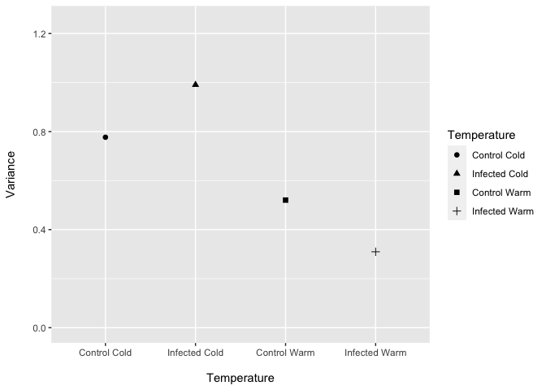<!-- -->

Models looking at residuals from beta regression

The first model specifies a random intercept. If mean phagocytosis was the same between groups, the intercept would be the same. 

I then take the residuals from this model and use them as the response variable with groups as the predictor variable, essentially asking, is the variation in the deviation from the overall mean explained by the treatment that the bird was in?

This is still comparing the mean of the residual squares though - should I take the CV of the residuals? 

```r
beta_mod1 <- betareg(phago_score ~ 1, data=ti)
ti$resid <-resid(beta_mod1) #residuals
ti$resid2 <-(resid(beta_mod1)^2) #residuals squared
ti$resid3 <- abs(resid(beta_mod1)) #absolute residuals

#all groups
lm.resid1 <- glm(resid~groups, data=ti)
summary(lm.resid1) #warm infected had more positive residuals = were overall higher than the mean > makes sense
```

```
## 
## Call:
## glm(formula = resid ~ groups, data = ti)
## 
## Coefficients:
##                     Estimate Std. Error t value Pr(>|t|)  
## (Intercept)          -0.5450     0.3213  -1.696   0.0970 .
## groupsCold Infected   0.5730     0.4207   1.362   0.1801  
## groupsWarm Control    0.4049     0.4544   0.891   0.3778  
## groupsWarm Infected   1.0062     0.4207   2.392   0.0211 *
## ---
## Signif. codes:  0 '***' 0.001 '**' 0.01 '*' 0.05 '.' 0.1 ' ' 1
## 
## (Dispersion parameter for gaussian family taken to be 1.032543)
## 
##     Null deviance: 51.588  on 47  degrees of freedom
## Residual deviance: 45.432  on 44  degrees of freedom
## AIC: 143.58
## 
## Number of Fisher Scoring iterations: 2
```

```r
plot(allEffects(lm.resid1))
```

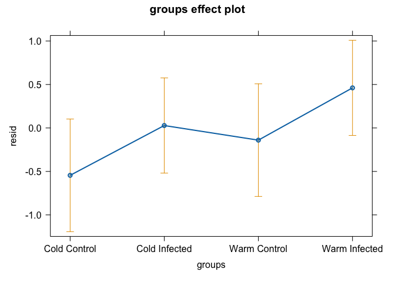<!-- -->

```r
lm.resid2 <- glm(resid2~groups, data=ti)
summary(lm.resid2) #confused by this one
```

```
## 
## Call:
## glm(formula = resid2 ~ groups, data = ti)
## 
## Coefficients:
##                     Estimate Std. Error t value Pr(>|t|)  
## (Intercept)          1.45954    0.54600   2.673   0.0105 *
## groupsCold Infected -0.01361    0.71488  -0.019   0.9849  
## groupsWarm Control  -0.68820    0.77216  -0.891   0.3776  
## groupsWarm Infected -0.81412    0.71488  -1.139   0.2609  
## ---
## Signif. codes:  0 '***' 0.001 '**' 0.01 '*' 0.05 '.' 0.1 ' ' 1
## 
## (Dispersion parameter for gaussian family taken to be 2.981164)
## 
##     Null deviance: 138.08  on 47  degrees of freedom
## Residual deviance: 131.17  on 44  degrees of freedom
## AIC: 194.47
## 
## Number of Fisher Scoring iterations: 2
```

```r
plot(allEffects(lm.resid2)) #mean residuals were not different between groups
```

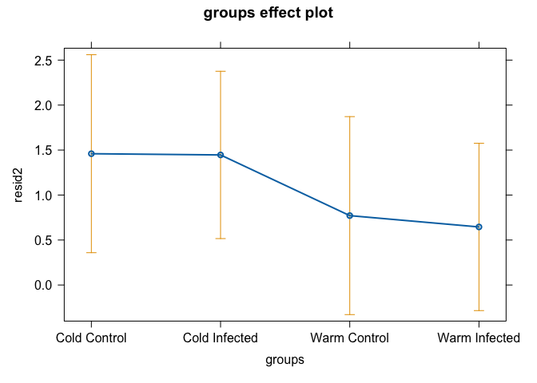<!-- -->

```r
lm.resid3 <- glm(resid3~temp + treatment, data=ti)
summary(lm.resid3) #mean absolute value of residuals was not different between groups
```

```
## 
## Call:
## glm(formula = resid3 ~ temp + treatment, data = ti)
## 
## Coefficients:
##                   Estimate Std. Error t value Pr(>|t|)    
## (Intercept)         0.8688     0.1777   4.889 1.33e-05 ***
## tempWarm           -0.2822     0.1928  -1.464    0.150    
## treatmentInfected   0.1170     0.1955   0.599    0.552    
## ---
## Signif. codes:  0 '***' 0.001 '**' 0.01 '*' 0.05 '.' 0.1 ' ' 1
## 
## (Dispersion parameter for gaussian family taken to be 0.4458497)
## 
##     Null deviance: 21.179  on 47  degrees of freedom
## Residual deviance: 20.063  on 45  degrees of freedom
## AIC: 102.35
## 
## Number of Fisher Scoring iterations: 2
```

```r
g.ra.effects <- allEffects(lm.resid3) #residuals were not different between groups
plot(g.ra.effects)
```

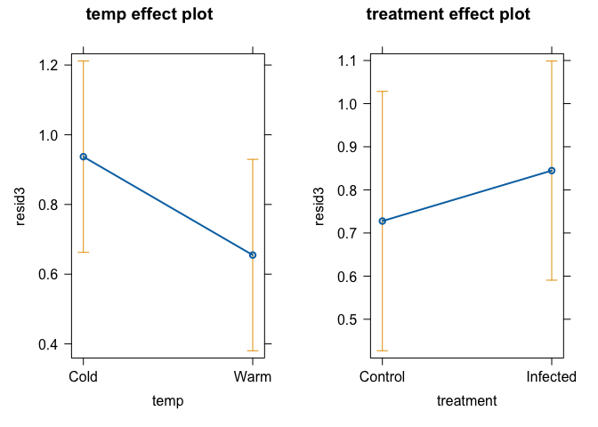<!-- -->

```r
g.r <- ggplot(ti, aes(x=groups, y=resid))+
  geom_point()+
  stat_summary(aes(group=groups), fun=mean, color="red")+
  labs(y="Residuals")

g.r2 <- ggplot(ti, aes(x=groups, y=resid2))+
  geom_point()+
  stat_summary(aes(group=groups), fun=mean, color="red")+
  labs(y="Residuals Squared")

g.ra <- ggplot(ti, aes(x=groups, y=resid3))+
  geom_point()+
  stat_summary(aes(group=groups, shape=groups), fun=mean, color="red")+
  labs(y="|Residuals|", x="Treatment Groups", shape="Treatment Groups")
g.r
```

```
## Warning: Removed 4 rows containing missing values (`geom_segment()`).
```

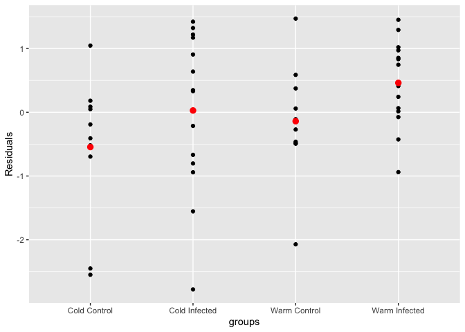<!-- -->

```r
g.r2
```

```
## Warning: Removed 4 rows containing missing values (`geom_segment()`).
```

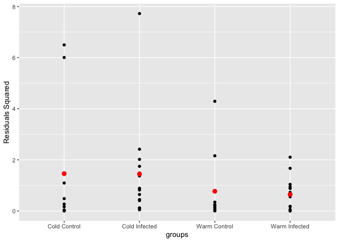<!-- -->

```r
g.ra
```

```
## Warning: Removed 4 rows containing missing values (`geom_segment()`).
```

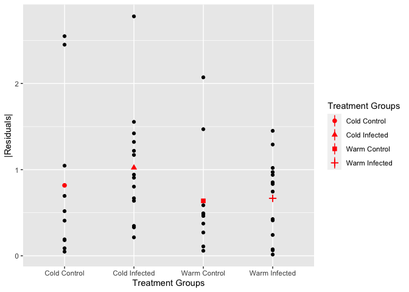<!-- -->


```r
glm1 <- glmer(phago_score ~ 1 + (1|band_number), weights=wbc_total+phago_total, data=ti, family=binomial)
ti$resid <-resid(glm1) #residuals
ti$resid2 <-(resid(glm1)^2) #residuals squared

#all groups
lm.resid1 <- glm(resid~groups, data=ti)
summary(lm.resid1) #warm infected had more positive residuals = were overall higher than the mean > makes sense
```

```
## 
## Call:
## glm(formula = resid ~ groups, data = ti)
## 
## Coefficients:
##                     Estimate Std. Error t value Pr(>|t|)  
## (Intercept)         -0.21936    0.09491  -2.311   0.0256 *
## groupsCold Infected  0.11295    0.12427   0.909   0.3684  
## groupsWarm Control   0.13463    0.13423   1.003   0.3213  
## groupsWarm Infected  0.26412    0.12427   2.125   0.0392 *
## ---
## Signif. codes:  0 '***' 0.001 '**' 0.01 '*' 0.05 '.' 0.1 ' ' 1
## 
## (Dispersion parameter for gaussian family taken to be 0.09008408)
## 
##     Null deviance: 4.3857  on 47  degrees of freedom
## Residual deviance: 3.9637  on 44  degrees of freedom
## AIC: 26.505
## 
## Number of Fisher Scoring iterations: 2
```

```r
plot(allEffects(lm.resid1))
```

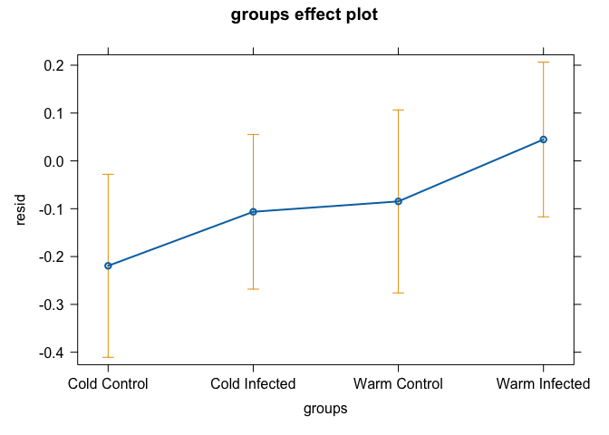<!-- -->

```r
lm.resid2 <- glm(resid2~groups, data=ti)
summary(lm.resid2) #confused by this one
```

```
## 
## Call:
## glm(formula = resid2 ~ groups, data = ti)
## 
## Coefficients:
##                     Estimate Std. Error t value Pr(>|t|)  
## (Intercept)          0.19384    0.08947   2.166   0.0357 *
## groupsCold Infected -0.05450    0.11715  -0.465   0.6441  
## groupsWarm Control  -0.13210    0.12653  -1.044   0.3022  
## groupsWarm Infected -0.17979    0.11715  -1.535   0.1320  
## ---
## Signif. codes:  0 '***' 0.001 '**' 0.01 '*' 0.05 '.' 0.1 ' ' 1
## 
## (Dispersion parameter for gaussian family taken to be 0.08005529)
## 
##     Null deviance: 3.7500  on 47  degrees of freedom
## Residual deviance: 3.5224  on 44  degrees of freedom
## AIC: 20.84
## 
## Number of Fisher Scoring iterations: 2
```

```r
plot(allEffects(lm.resid2)) #residuals were not different between groups
```

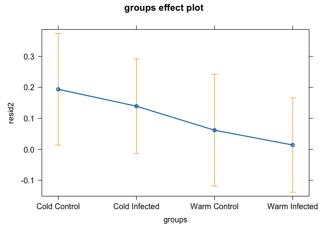<!-- -->

```r
#temperature
lm.resid3 <- glm(resid2~ temp, data=ti)
summary(lm.resid3)
```

```
## 
## Call:
## glm(formula = resid2 ~ temp, data = ti)
## 
## Coefficients:
##             Estimate Std. Error t value Pr(>|t|)   
## (Intercept)  0.16205    0.05673   2.856  0.00641 **
## tempWarm    -0.12813    0.08023  -1.597  0.11711   
## ---
## Signif. codes:  0 '***' 0.001 '**' 0.01 '*' 0.05 '.' 0.1 ' ' 1
## 
## (Dispersion parameter for gaussian family taken to be 0.07723981)
## 
##     Null deviance: 3.750  on 47  degrees of freedom
## Residual deviance: 3.553  on 46  degrees of freedom
## AIC: 17.255
## 
## Number of Fisher Scoring iterations: 2
```

```r
plot(allEffects(lm.resid3))
```

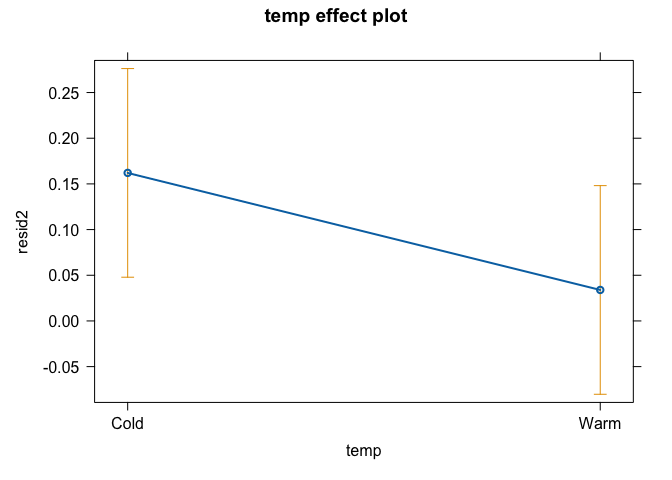<!-- -->

```r
ggplot(ti, aes(x=groups, y=resid))+
  geom_point()+
  stat_summary(aes(group=groups), fun=mean, color="red")
```

```
## Warning: Removed 4 rows containing missing values (`geom_segment()`).
```

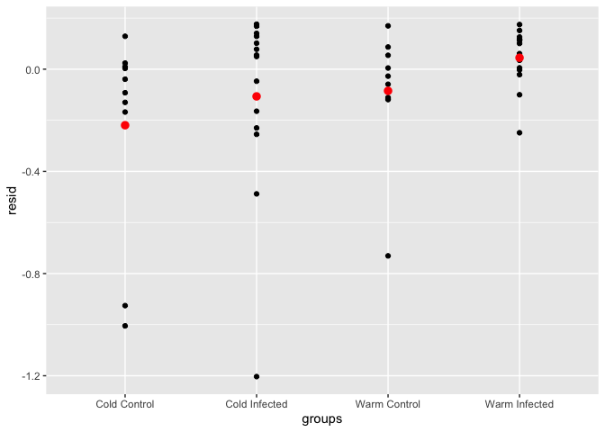<!-- -->

```r
ggplot(ti, aes(x=groups, y=resid2))+
  geom_point()+
  stat_summary(aes(group=groups), fun=mean, color="red")
```

```
## Warning: Removed 4 rows containing missing values (`geom_segment()`).
```

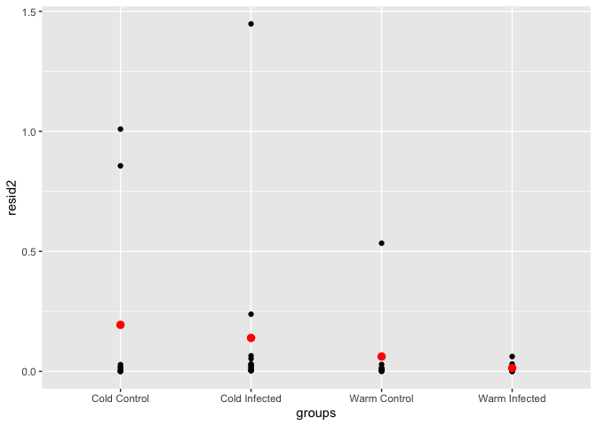<!-- -->

Look at the raw data using histograms

```r
treat_names_n <- c(
  'Cold Infected' = "Cold Infected (n=14)",
  'Warm Control' = "Warm Control (n=10)",
  'Warm Infected' = "Warm Infected (n=14)",
  'Cold Control' = "Cold Control (n=10)"
)

#Add variable indicating the phago_score mean for each treatment group
p.ti <- ti%>%
  group_by(groups)%>%
  mutate(groupmean = mean(phago_score))%>%
  ungroup()

m.ti <- p.ti %>%
  mutate(meanall = mean(phago_score)) %>%
  ungroup()

#histogram showing variability in phagocytosis scores across treatment groups
ggplot(p.ti, aes(x=phago_score, fill=groups))+
  geom_histogram(binwidth = 0.01, position="identity", alpha=1, color="black")+
  geom_vline(data = p.ti, aes(xintercept = groupmean, color = "red"), linetype = "dotted",alpha = 1, show.legend=FALSE) + #mean of each group to show differences
  geom_vline(data=m.ti, aes(xintercept = meanall, color = "black"), linetype="dashed", alpha=1, show.legend=FALSE)+ #mean of all groups combined to compare
  scale_fill_manual(values=c( "gray75", "white", "gray35","black"))+
  scale_color_manual(values = c("black", "red"), guide = guide_legend(title= NULL))+
  facet_wrap(~groups, nrow=4, labeller = as_labeller(treat_names_n), scales="fixed")+
  labs(x="Phagocytosis Score", y="Count", fill="Treatment")+
  theme_minimal()
```

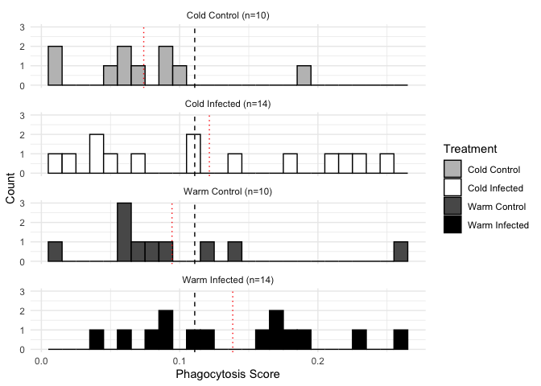<!-- -->

I can also calculate coefficient of variation

```r
p.ti$N = p.ti$wbc_total + p.ti$phago_total #add column with total number of cells per band_number

m.cv.all <- p.ti %>% 
  group_by(groups)%>%
  summarise(mean.phago = mean(phago_score, na.rm=T), #mean
            all.Ns = sum(N, na.rm = T), #total number of cells
            sd.binom = sqrt(all.Ns*mean.phago*(1-mean.phago)), #standard deviation = square root(N * mean * (1-mean))
            bird_cv = (sd.binom/mean.phago)) #CV = standard deviation / mean * 100

m.cv.all
```

```
## # A tibble: 4 × 5
##   groups        mean.phago all.Ns sd.binom bird_cv
##   <chr>              <dbl>  <int>    <dbl>   <dbl>
## 1 Cold Control      0.0740   5437     19.3    261.
## 2 Cold Infected     0.122    7560     28.4    234.
## 3 Warm Control      0.0945   5193     21.1    223.
## 4 Warm Infected     0.138    7795     30.5    220.
```

```r
#generate error bar values
m.cv.all$max <- m.cv.all$bird_cv + m.cv.all$sd.binom
m.cv.all$min <- m.cv.all$bird_cv - m.cv.all$sd.binom
m.cv.all$groups <- factor(m.cv.all$groups, levels = c("Cold Control", "Cold Infected", "Warm Control", "Warm Infected"))
#Graph of CVs
cv.all.primary <- ggplot(m.cv.all, aes(x=groups, y=bird_cv, shape=groups))+
  labs(x="Treatment Groups", y="CV", shape="Treatment Groups", color="Temperature")+
  geom_point(aes(shape=groups), size=3)+
  #scale_shape_manual(values = c(0, 15, 1, 16))+
  #scale_color_manual(values=c("blue", "red"))+
  ylim(c(0, 300))

cv.all.primary
```

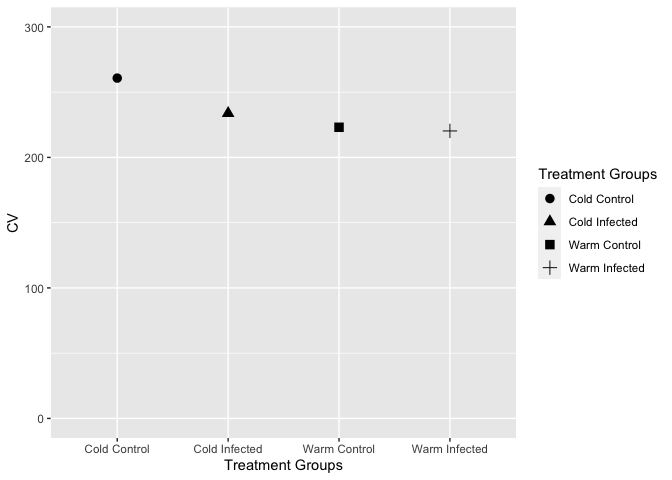<!-- -->

*Summary* 
Using a beta regression, I show that infection with MG (p = 0.037), but not temperature at which a bird was held (p = 0.117), significantly affected phagocytic activity during infection. 

```r
phago.pred
```

```
## Warning: Removed 2 rows containing missing values (`geom_segment()`).
```

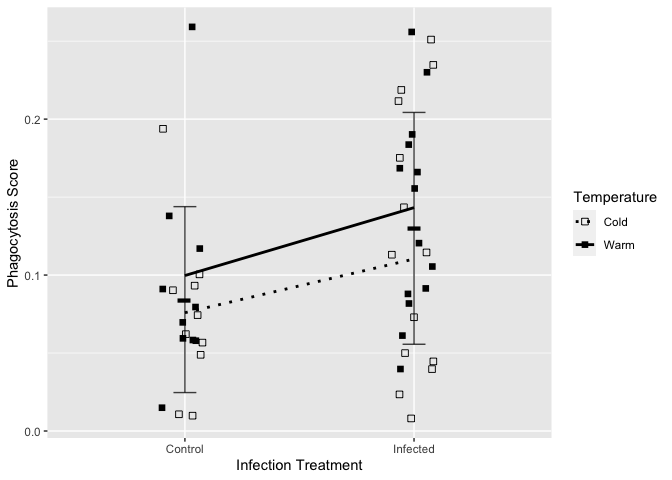<!-- -->

I also show through various methods that the mean variation does not significantly differ across treatments. 


```r
g.var #variance from binomial models
```

<!-- -->

```r
cv.all.primary #coefficient of variation 
```

<!-- -->

```r
g.ra #absolute values of residuals
```

```
## Warning: Removed 4 rows containing missing values (`geom_segment()`).
```

<!-- -->

```r
plot(g.ra.effects) #allEffects absolute values of residuals
```

<!-- -->

